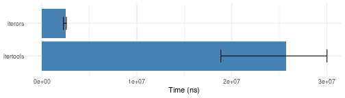
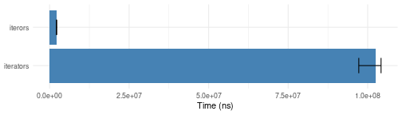
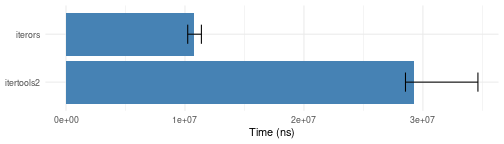

--
title: "Benchmarking Iteration"
output: rmarkdown::html_vignette
vignette: >
  %\VignetteEngine{knitr::rmarkdown}
  %\VignetteIndexEntry{Benchmarking Iteration}
  %\VignetteEncoding{UTF-8}
---

This document illustrates the differences in performance between `iterors` and previous packages `iterators`/`itertools`/`itertools2`.  Basic gains come from the `nextOr` method  avoiding the need for `tryCatch`, as well as the fact that iterors can be used simply as functions, skipping S3 dispatch. Additionally, over the process of curating the `iterors` package, several iterator implementations have been optimized for performance. 


Because this is a more computationally intensive vignette, it is built manually and included in the released package statically.  The `Rmd` source is in the Git repo under the `scratch` directory; knit it manually and copy it into the vignettes directory to publish. When this document was last built, it was under these conditions:

* iterors version 1.0,  git revision 584769a8 ()
* itertools2 version 0.1.1
* itertools version 0.1.3
* OS: Linux 5.4.0-148-generic
* CPU: Intel(R) Core(TM) i5 CPU       M 520  @ 2.40GHz.
* R version 4.3.0 (2023-04-21), svn rev 84292


# Basic iterators (self-contained/memory-backed)

## Consuming iterators

Since the following tests will use different versions of `icount`, `iter_consume`, and `as.list`,
first check how close those functions are.


```r
as.list.bench <- microbenchmark::microbenchmark(
  iter_consume = iter_consume(iterators::icount(3000)),
  iterors.consume = iterors::consume(iterors::icount(3000)),
  iterators.as_list = as.list(iterators::icount(3000)),
  iterors.as_list = as.list(iterors::icount(3000)),
  times = 10)
plotit(as.list.bench)
```


Note that we are using our own function `iter_consume`, as `itertools::consume` has poor performance due to invoking `try` on every item.

## Simple iteration over a vector

```r
vector.bench <- microbenchmark::microbenchmark(
    iterators = iter_consume(iterators::iter(1:1000)),
    iterors = iterors::consume(iterors::iteror(1:1000)),
    times = 10)
  plotit(vector.bench)
```


## Chunking a vector

```r
chunk.bench <- microbenchmark::microbenchmark(
  itertools = iter_consume(itertools::isplitVector(1:6000, chunkSize=17)),
  iterors = iterors::consume(iterors::iteror(1:6000, chunkSize=17)),
  times = 10)
plotit(chunk.bench)
```



## Extracting rows or columns


```r
arr <- array(1:1000000, c(1000,1000))
slice.bench <- microbenchmark::microbenchmark(
  iterators.rows = iter_consume(iterators::iter(arr, by="row")),
  iterators.cols = iter_consume(iterators::iter(arr, by="column")),
  itertools.array_rows = iter_consume(itertools::iarray(arr, MARGIN = 1)),
  itertools.array_cols = iter_consume(itertools::iarray(arr,MARGIN = 2)),
  iterors.rows = iterors::consume(iterors::iteror(arr, by=1)),
  iterors.cols = iterors::consume(iterors::iteror(arr, by=2)),
times = 10)
plotit(slice.bench)
```


## Split matrix into chunks


```r
arr <- array(1:1000000, c(1000,1000))
array_chunks.bench <- microbenchmark::microbenchmark(
  itertools.rows = iter_consume(itertools::isplitRows(arr, chunkSize=7)),
  itertools.cols = iter_consume(itertools::isplitCols(arr, chunkSize=7)),
  iterors.rows = iterors::consume(iterors::iteror(arr, by=1, chunkSize=7)),
  iterors.cols = iterors::consume(iterors::iteror(arr, by=2, chunkSize=7)),
times = 10)
plotit(array_chunks.bench)
```


## Enumerating N-D array indices:

```r
 icountn.bench <- microbenchmark::microbenchmark(
   iterators = iter_consume(iterators::icountn(c(4,5,6,7))),
    iterors = iterors::consume(iterors::icountn(c(4,5,6,7))),
    times =10)
 plotit(icountn.bench)
```



## Cartesian product of vectors


```r
igrid.bench <- microbenchmark::microbenchmark(
  # itertools2 = iter_consume(itertools2::iproduct(1:10, letters, month.name)),
  itertools = iter_consume(itertools::product(1:10, letters, month.name)),
  itertools2 = iter_consume(itertools2::iproduct(1:10, letters, month.name)),
  iterors = iterors::consume(iterors::igrid(1:10, letters, month.name)),
  times = 10)
plotit(igrid.bench)
```


## Random number generation

When `independent=TRUE` there is extra work in saving and restoring the
random number generator settings.

```r
sampling.bench <- microbenchmark::microbenchmark(
    iterators = as.list(iterators::irunif(100, count=100)),
    iterors.independent = as.list(iterors::irunif(100, count=100, independent=TRUE)),
    iterors.dependent = as.list(iterors::irunif(100, count=100, independent=FALSE)),
    times = 100)
plotit(sampling.bench)
```


# Higher order iterators / iterator functions

## Chaining iterators end-to-end

```r
chain.bench <- microbenchmark::microbenchmark(
  itertools = iter_consume(
    do.call(itertools::chain,
            lapply(1:50, iterators::icount))),
    itertools2 = iter_consume(
      do.call(itertools2::ichain,
              lapply(1:50, iterators::icount))),
  iterors =
    iterors::consume(do.call(iterors::i_chain, lapply(1:50, iterors::icount))),
  iterors.collapse =
    iterors::consume(iterors::i_concat(iterors::i_apply(1:50, iterors::icount))),
  times=10)
plotit(chain.bench)
```


## Keeping or dropping items according to a criterion


```r
i_keep.bench <- microbenchmark::microbenchmark(
    iterators = as.list(itertools::ifilter(\(x) floor(sqrt(x))^2 == x, iterators::icount(5000))),
    iterors = as.list(iterors::i_keep(iterors::icount(5000), \(x) floor(sqrt(x))^2 == x)),
    times = 10)
plotit(i_keep.bench)
```


## Select only unique values

`iterors::i_unique` uses a hash table for better performance.


```r
i_unique.bench <- microbenchmark::microbenchmark(
       iterators = {
         it <- itertools2::iunique(iterators::isample(1:100, 1))
         as.numeric(itertools2::take(it, 100))
       },
       iterors = {
         it <- iterors::i_unique(iterors::isample(1:100, 1, independent=FALSE))
         iterors::take(it, 100, "numeric")
       },
       times=10)
plotit(i_unique.bench)
```


## i_recycle

Note that `itertools2::icycle` only works for self-contained vector-based iterators, while the other two use a general purpose buffer.


```r
icycle.bench <- microbenchmark::microbenchmark(
  itertools2 = as.list(itertools2::icycle(iterators::icount(20), times = 20)),
  itertools = iter_consume(itertools::recycle(iterators::icount(20), times = 20)),
  iterors = iterors::consume(iterors::i_recycle(iterors::icount(20), times = 20)),
  times = 20)
plotit(icycle.bench)
```


## i_tee

Note that `itertools2::tee` only works for vector-based iterators it
knows how to clone, while `iterors::i_tee` uses a general purpose
buffering mechanism.


```r
i_tee.bench <- microbenchmark::microbenchmark(
  itertools2={
    iter_consume(
      do.call(itertools::chain,
        itertools2::itee(1:20, n=20)))
  },
  iterors={
    iterors::consume(
      iterors::i_concat(
        iterors::i_tee(iterors::icount(20), n=20)))
  },
  times=20)
plotit(i_tee.bench)
```



## Sliding window iterators

`iterors` uses specialized routines for n=2 and n=3. For n=4 and above, a
general purpose queue is used.


```r
marks=c(alist(
  itertools2.w2={iter_consume(itertools2::ipairwise(1:200))}),
  if (exists("itripletwise", asNamespace("itertools2"), inherits=FALSE)) {
    alist(itertools2.w3={iter_consume(itertools2::itripletwise(1:200))})
  },
  alist(
    iterors.w2={iterors::consume(iterors::i_window(1:200, 2))},
    iterors.w3={iterors::consume(iterors::i_window(1:200, 3))},
    iterors.w4={iterors::consume(iterors::i_window(1:200, 4))},
    iterors.w50={iterors::consume(iterors::i_window(1:200, 50))}))
i_window.bench <- microbenchmark::microbenchmark(list=marks, times=10)
plotit(i_window.bench)
```


